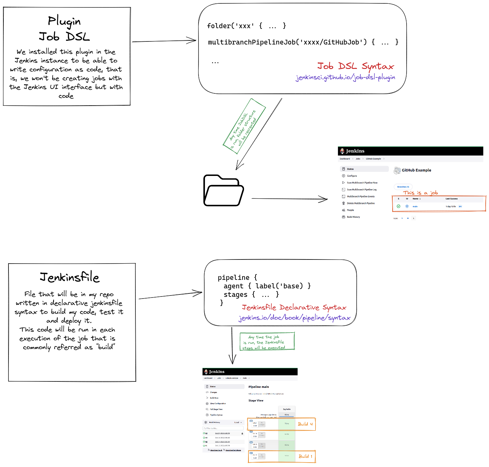

# kc-devops-6-cicd-jenkins-system

Files needed to build a normalized Jenkins instance in AWS

## Prepare environment

### 1. Instance creation in AWS

Characteristics of the required EC2 instance:
- Ubuntu Server 22.04 LTS (HVM), SSD Volume Type
- Architecture 64-bit (x86)
- t2.large (2 vCPU, 8GiB memory)
- Create a key pair to connect with ssh (download the .pem file to your computer)
- Network settings:
  - Create security group
  - Mark Allow SSH traffic from your IP
  - Mark Allow HTTP traffic from your IP
- Storage: Create 30GiB gp2 root volume (non encrypted)

Once created connect with the machine > go to EC2 dashboard > select the machine just created > connect > ssh client. Follow instructions to connect with it using ssh and the key pair you have created

### 2. Instance provisioning

1. Once inside the ec2 machine, create a file `vim 1_machineProvisioning.sh` and copy inside the contents of [1_machineProvisioning.sh](./1_machineProvisioning.sh). Save it
1. Repeat the step with [2_machineProvisioning.sh](./2_machineProvisioning.sh). Create a file in the machine with the same name and its contents.
1. Give the file execution permissions with `sudo chmod +x 1_machineProvisioning.sh`
1. Repeat the steps with [2_machineProvisioning.sh](./2_machineProvisioning.sh). Copy in a file in the machine and give it permissions to execute.
1. Execute [1_machineProvisioning.sh](./1_machineProvisioning.sh).
1. In the standard output it will appear a line similar to this `ssh-rsa <<alpahanumericChain>> jenkins`, copy it and add it to your github account > settings > ssh and gpg keys > new ssh key
1. Then reboot the machine with `sudo reboot`
1. Connect again via ssh
1. Execute [2_machineProvisioning.sh](./2_machineProvisioning.sh). It will prompt for a password to `ubuntu` user, set it to something you can remember as will be prompted soon
1. Pick the password jenkins is showing in the console output

### 3. Jenkins configuration
1. Go to AWS ec2 dashboard again > select your instance > Public IPv4 address > copy the IP
1. Open your jenkins in the browser accessing to http://theIPv4Address. You should see jenkins asking the password you pick from console output, input it
1. Install suggested plugins > Install just the following: `folders`, `build timeout`, `timestamper`, `pipeline`, `pipeline: stage view`, `git`
1. Add an `admin` user with a password you can remember in the next screen. Leave the URL as it is in the next screen. Initial configuration is done.

### 4. Add required credentials
We will need credentials to:
    1. Use our private repos in Github
    2. Connect with the docker agents in a distributed build scenario
    3. Upload artifacts to Pypi

#### Create the key to connect with the agents
1. Go to manage jenkins > manage credentials > Stores scoped to Jenkins > System > Global credentials (unrestricted) > Add credentials
1. Place "jenkins" as username and "jenkins" as password. As id set "ssh-agents-key". Leave the rest with the defaults. Click on create

#### Create the key to acces github
1. Go to manage jenkins > manage credentials > Stores scoped to Jenkins > System > Global credentials (unrestricted) > Add credentials
1. Set the kind to "ssh username with private key". As id set "ssh-github-key". Usernames is "jenkins". Click on enter directly the private key and, in a terminal connected with the ec2 machine do `cat ~/.ssh/id_rsa` which will print the private key. Copy it carefully and provide it to Jenkins. Click on create

#### Configure known host strategy

Last we need to configure security to connect with github. We go to manage Jenkins > configure global security >  Git Host Key Verification Configuration > Accept First connection (No verification?) VER COMO LO PONGO

### 5. Last sessions recap
Let's create in this instance with JobDSL the jobs we used to have:
1. Go to Manage Jenkins > Manage plugins > Available tab > Install `Github`, `JobDSL`  and `docker` with restart
1. As the restart kills our container, you will need to go to the terminal you have opened with the EC2 machine a run `cd kc-devops-6-cicd-jenkins-system/ && docker-compose up` again
1. We then refresh the browser, Jenkins will be asking for the admin password, sign in there
1. Go to new item > Set 0.Seed as name > freestyle project > OK
1. Mark the checkbox `Add timestamps to the Console Output`
1. In Build Steps > Process Job DSLs
1. Mark the radio button "Use the provided DSL script" and enter in the text field the contents of [job.dsl](./job.dsl) with the SSH URL of the repo with Jenkinsfile
1. Click on save and run the job 0.Seed in the button "Build now". It will fail for script approval missing.
1. Go to Manage Jenkins > In-process Script Approval and approve the script
1. Run again the 0.Seed

## Jenkins structure and builds generated by JobDSL

